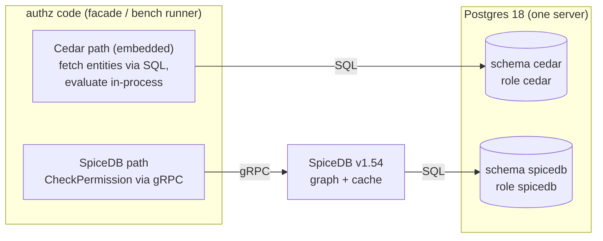

# Cedar vs SpiceDB — Authorization Engine Benchmark

An **apple-to-apple benchmark** of two authorization engines with fundamentally different shapes —
**Cedar** (embedded library, in-process) vs **SpiceDB** (standalone server) — on **one Postgres
server**, across five access models (**RBAC, ReBAC, ABAC, PBAC, ACL**), each backed by
**≥1,000,000 rows per engine** — 6,763,880 Postgres rows (Cedar) + 5,486,457 relationships
(SpiceDB) = **12.25M records combined** — in the context of an imagined enterprise SaaS ERP
("Nusantara ERP"). Both engines hold the identical logical dataset from one deterministic
generator, and an **equivalence gate** (Cedar == SpiceDB == expected on 42,836 ground-truth tuples)
must pass before any timing runs.



## Documentation

| Doc | What it covers |
|---|---|
| **[01 — Use Case](docs/01-use-case.md)** | The full ERP context (tenants, subsidiaries, divisions/roles, personas, app-permission registry), field conditions behind each access model, and how the deterministic dataset is generated — with real sample data. |
| **[02 — Architecture](docs/02-architecture.md)** | How each engine works (embedded vs server), the hexagonal layout, check flows step by step, the twin Cedar/SpiceDB schemas per model, schema isolation on one Postgres, and the seeding pipeline. |
| **[03 — Benchmark Results](docs/03-benchmark-results.md)** | Scenarios (ground-truth tuples, adversarial denies), methodology + fairness rules, environment snapshot, and full results: **average, p50, p90, p95, p99** + throughput per model × engine × concurrency. |

Key artifacts: [catalog/services.json](catalog/services.json) (ERP registry metadata) ·
[policies/](policies/) (Cedar, one file per model) ·
[schema/spicedb/schema.zed](schema/spicedb/schema.zed) ·
[http/](http/) (ready-made allow/deny requests per engine × model) ·
[.issues/](.issues/) (gotcha/risk register G1–G18) · [.plan/](.plan/) (project plan).

## Quick start

```bash
make up          # postgres (roles/schemas only) + spicedb-migrate + spicedb + facade
make seed        # deterministic seeder → BOTH engines + ground-truth tuples (batch 1000, resumable)
make verify      # equivalence gate — MUST pass before benchmarking
make bench       # timed cells → console + bench/results/<ts>.{csv,json}

make seed-test   # miniature dataset for a fast end-to-end smoke test
make help        # all targets
```

One manual check via the facade (engine selected per request):

```bash
curl -s localhost:8080/v1/authorize -H 'Content-Type: application/json' -d '{
  "engine": "cedar", "model": "pbac", "principal": "psn-015173",
  "action": "po.approve", "resource_type": "PurchaseOrder", "resource": "po-000122",
  "context": { "amount": 486452549, "region": "medan" }
}'
```

## Findings worth knowing (details in the docs & [.issues/](.issues/))

- **SpiceDB schema isolation on shared Postgres** works via Postgres-side `search_path` — it is not
  an official SpiceDB feature (verified by smoke test; re-check after upgrades).
- **SpiceDB `ImportBulkRelationships` (binary COPY) breaks against Postgres 18** (`08P01`); the
  seeder uses `WriteRelationships` + `OPERATION_TOUCH` in 1000-record batches instead.
- **Benchmark harnesses lie easily** — an adversarial review caught the pgx pool defaulting below
  the bench concurrency, single-threaded warmup, and errored-check timing; all fixed, first run
  superseded (see [03 — Benchmark Results](docs/03-benchmark-results.md)).

## Layout

```
cmd/authz-service/     HTTP facade (engine per request)
cmd/authz-seed/        deterministic dual-engine seeder (-engine, -scale, -wipe, -resume)
cmd/authz-bench/       -mode verify (equivalence gate) | -mode run (timing)
internal/core/         hexagonal core: domain, ports, router
internal/adapter/      inbound/rest · outbound/{cedar,postgres,spicedb}
internal/seed/         generator · writers · tuple sampler
internal/bench/        measurement harness
catalog/ policies/ schema/ http/ docs/ db/
```
