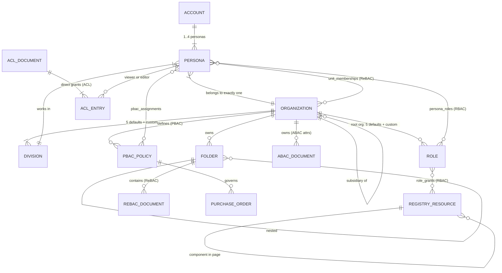
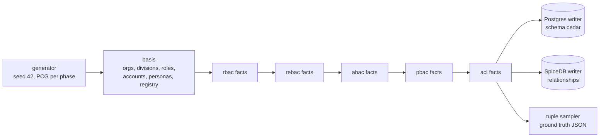

# 01 — Use Case: "Nusantara ERP" and the Benchmark Dataset

> Part of the [documentation index](../README.md). Next: [02 — Architecture](02-architecture.md) ·
> [03 — Benchmark Results](03-benchmark-results.md)

This benchmark does not use synthetic random tuples. It models a **complete, imagined enterprise
SaaS ERP** — "Nusantara ERP" — and generates every authorization fact from that domain, so both
engines answer *business questions*, not toy lookups.

## 1. The business context

**Nusantara ERP** is a multi-tenant SaaS ERP for the Indonesian market, serving **B2B and B2C**,
from warung-scale businesses up to conglomerates ("low to high market" — assume very enterprise).
Two levels of administration exist:

- **Platform level** — the SaaS owner's staff (application admins) who operate the platform itself.
- **Business level** — each customer organization's own owners/admins who manage their tenant.

### Organizations & subsidiaries
A tenant is a **root organization** that may own a tree of **subsidiaries** (up to 6 levels,
depth 0–5). Access often flows *down* this tree: a manager at the holding company needs visibility
into a branch's documents, never the other way around, and **never across tenants**.

A real generated chain from the seeded database — the deepest subsidiary path is **6 levels**
(depth 0–5). Note the region changes down the tree, which is exactly what the ABAC data-residency
rule keys on:

| depth | id | parent_id | region | name |
|---|---|---|---|---|
| 0 | org-00235 | — | denpasar | PT Halmahera Abadi 0235 |
| 1 | org-02536 | org-00235 | balikpapan | …0235 Unit 2536 |
| 2 | org-02867 | org-02536 | surabaya | …Unit 2536 Regional 2867 |
| 3 | org-02964 | org-02867 | surabaya | …Regional 2867 Regional 2964 |
| 4 | org-03406 | org-02964 | semarang | …Regional 2964 Regional 3406 |
| 5 | org-04566 | org-03406 | jakarta | …Regional 3406 Pabrik 4566 |

### Divisions & roles — defaults plus per-org customization
Every org node gets the **5 default divisions** (`finance`, `procurement`, `hr`, `sales`,
`operations`) and each **root org** gets the **5 default role types** (`owner`, `admin`, `manager`,
`staff`, `auditor`). Both are customizable per organization — real generated examples:

| custom division | org | custom role | org |
|---|---|---|---|
| `csr` (div-000005) | org-00000 | `account-executive` (role-000010) | org-00001 |
| `r-and-d` (div-000006) | org-00000 | `warehouse-lead` (role-000016) | org-00002 |

### Accounts & personas
End users hold a **root account**; each account has 1–4 **personas** (children of the account), and
**one persona belongs to exactly one organization node**, one division, and carries ABAC attributes
(clearance 1–4, employment type, region). Real generated examples:

| id | account | org | division | clearance | employment | region |
|---|---|---|---|---|---|---|
| psn-015173 | acc-015173 | org-31376 | quality-assurance | 2 | full-time | makassar |
| psn-225004 | acc-225004 | org-35158 | sales | 3 | intern | bandung |
| psn-000000 | acc-000000 | org-00348 | (div-002416) | 4 | full-time | bandung |

### The application-permission registry (5 microservices as metadata)
The ERP is imagined as **5 microservices** — `identity`, `finance`, `procurement`, `hr`, `sales` —
declared as *metadata* in [catalog/services.json](../catalog/services.json): **54 backend
endpoints**, **42 UI pages**, and **~420 UI components**, every single one a first-class permission
target (actions `execute` / `view` / `render`). IDs are derived as `ep/<svc>/<key>`,
`pg/<svc>/<key>`, `cmp/<svc>/<page>/<name>` — `/` instead of `:` because SpiceDB object IDs forbid
colons (gotcha G2 in [.issues/01_gotcha_20260709.md](../.issues/01_gotcha_20260709.md)).

## 2. Field conditions → the five access models

Each benchmarked model is a real condition in this ERP, not an abstract pattern:

| Model | Business scenario | Example check |
|---|---|---|
| **RBAC** | "Only finance managers may call the invoice-approve endpoint / see the payroll page / render the export button." Role grants over the app registry; personas hold 1–4 roles. | May a role holder `view` page `pg/sales/sales-dashboard`? |
| **ReBAC** | "A manager at the holding company sees the Surabaya branch's documents" — document → folder → org-unit → ancestor traversal; membership at an ancestor grants downward visibility. ~5% of folders are additionally **shared with a second unit** of the same tenant (cross-division collaboration — graph fan-in). Cross-tenant access must be impossible. | May a persona at an ancestor (or shared) unit `doc.view` a descendant's document? |
| **ABAC** | "Confidential (classification 3) finance documents are readable only by finance staff with clearance ≥ 3 **in the same region** (data residency) — clearance-4 national auditors override the region check; archived documents are readable by no one." | May a clearance-2 operations persona in the wrong region read a classification-3 finance doc? (deny) |
| **PBAC** | "Each organization defines its own approval policies: *sales POs between Rp 5jt and Rp 424jt, only in Surabaya/Balikpapan/Jakarta*." Below the floor is petty cash (no approval flow), above the ceiling exceeds the mandate. Policy rows are data; amount/region arrive at request time. | May an assignee `po.approve` a PO whose amount sits inside the policy window, in a covered region? (allow) |
| **ACL** | "Share this document with these people" — 2–4 direct per-resource grants; editors can also view. | May a persona with only a `view` entry `acl.edit`? (deny) |

Real generated PBAC policy governing `po-000000` — note the **amount window** (`min_amount` floor:
below it is petty cash → deny; above `max_amount` exceeds the mandate → deny) and the region list:

| id | org | name | division | min_amount | max_amount | regions | active |
|---|---|---|---|---|---|---|---|
| pol-009272 | org-00231 | approval-policy-32 | sales | 5.000.000 | 424.000.000 | {surabaya, balikpapan, jakarta} | true |

## 3. The domain model

## 4. Data generation — deterministic, dual-engine, ground-truthed

The entire dataset is produced by **one deterministic generator**
([internal/seed/generator.go](../internal/seed/generator.go)) using a fixed-seed PCG PRNG
(`-seed 42`) with an **independent stream per phase**, so the same seed always yields the
byte-identical dataset — and the same stream feeds three interchangeable sinks: the Postgres writer
(Cedar's data), the SpiceDB writer (relationships), and the ground-truth **tuple sampler**.

### Row budgets (FullScale, ≥3M countable rows per model per engine)
Defined in [internal/seed/types.go](../internal/seed/types.go) (`FullScale()`), verified against the
seeded database:

| Slice | Budget | Countable per model |
|---|---|---|
| Root orgs → org nodes | 2.500 → 40.000 (subsidiary depth ≤ 6, reaches 6 levels) | basis |
| Divisions / roles | 280.049 / 21.181 (5 defaults + custom per org) | basis |
| Accounts → personas | 750.000 → 1.200.000 | basis |
| RBAC: persona_roles (1–4 roles, avg ~2.5) + role_grants (12/role) | 3.000.775 + 254.172 | **3.254.947** |
| ReBAC: docs + folders (16.922 shared) + memberships + org edges | 1.800.000 + 360.000 + 1.298.478 | **3.458.478** |
| ABAC: attribute documents (with region) | 3.000.000 | **3.000.000** |
| PBAC: assignments + PO links + policies (min/max window) | 2.256.155 + 800.000 + 100.000 | **3.156.155** |
| ACL: 1M docs × 2–4 entries + the docs themselves | 2.999.375 entries + 1.000.000 docs | **3.999.375** |

### Seeded totals — exact counts, verified against both engines

Queried directly from the seeded database (seed 42, FullScale; SpiceDB counts are **live**
relationships — its MVCC keeps deleted tuples as tombstones until GC, so naive `count(*)` on
`relation_tuple` over-counts):

| Use case | Cedar rows (schema `cedar`) | SpiceDB live relationships | Note |
|---|---:|---:|---|
| RBAC | 3,254,947 (persona_roles 3,000,775 + role_grants 254,172) | **3,254,947** (role 3,000,775 + endpoint 26,479 + page 20,862 + component 206,831) | exact match |
| ReBAC | 3,458,478 (rebac_documents 1,800,000 + folders 360,000 + unit_memberships 1,298,478) | 3,672,531 (rebac_document 1,800,000 + folder 536,553 + org_unit 1,335,978) | +214,053 on SpiceDB: org-parent and shared-folder links are columns in Postgres but separate edges in SpiceDB |
| ABAC | 3,000,000 | **3,000,000** | exact match |
| PBAC | 3,156,155 (assignments 2,256,155 + POs 800,000 + policies 100,000) | 3,056,155 (pbac_policy 2,256,155 + purchase_order 800,000) | −100,000 on SpiceDB: policy parameters live as caveat context on PO edges, not as separate rows |
| ACL | 3,999,375 (acl_entries 2,999,375 + acl_documents 1,000,000) | 2,999,375 (viewer/editor) | SpiceDB materializes only the grants; documents are implicit (2,999,375 = 99.98% of 3M) |
| Basis (identity: accounts 750,000 · personas 1,200,000) | 1,950,000 | — (personas enter above as assignees/members) | Cedar-only tables |
| **Total** | **≈18.9M rows** | **15,983,008 relationships** | **≈35M combined** — one Postgres server, two schemas |

### Nested paths ("cloud-storage" folders) — how deep can they go?
The document/folder use case behaves like cloud storage, and the nesting support is **structurally
unbounded on both engines** — depth is a *data* property, not a schema property:

- **Cedar side**: the loader walks the chain with a Postgres **recursive CTE**
  ([internal/adapter/outbound/postgres/loader.go](../internal/adapter/outbound/postgres/loader.go)) —
  no depth limit in the query — and Cedar's `in` operator follows parent chains of any length.
- **SpiceDB side**: `folder.parent->view` / `org_unit.parent->view_docs` arrows recurse natively.
  The practical bound is the server's `--dispatch-max-depth`, **default 50** (verified against
  SpiceDB v1.54.0 `serve --help`) — deeper paths would need that flag raised.

What the generated dataset actually exercises:

| Chain | Generated depth (measured by recursive CTE on the seeded DB) |
|---|---|
| Organization subsidiary tree | up to **6 levels** (depth 0–5) across 2.500 roots |
| Folder nesting inside an org (self-referential `parent_id`) | up to **7 levels** |
| Effective document path (`doc → folder chain → unit → ancestor units`) | up to **~13 hops** (1 doc→folder + ≤6 folder-parent + 1 folder→unit + ≤5 org-parent) |

So the answer to "how deep can cloud-storage paths go?" is: **unlimited by design** — the schema
imposes no ceiling on either engine; the only hard limit anywhere is SpiceDB's `--dispatch-max-depth`
(default 50). The seeded dataset currently exercises 7 folder levels and 6 org levels.

### Operational properties
- **Never at container start** — [db/bootstrap.sh](../db/bootstrap.sh) only creates roles/schemas;
  all data arrives via `make seed` ([cmd/authz-seed/main.go](../cmd/authz-seed/main.go)).
- **Batched 1000** records per write on both engines, with progress (rate + ETA) per phase.
- **Resumable** — per-phase checkpoints carry a `seed=… scale=…` fingerprint; resuming under
  different parameters is refused (IDs overlap across scales — gotcha G4), use `-wipe`.
- **Ground truth** — the sampler ([internal/seed/sampler.go](../internal/seed/sampler.go)) emits
  43.032 tuples with *known* expected decisions (the generator created the facts), including
  adversarial denies: cross-tenant personas, insufficient clearance, over-limit amounts, archived
  documents, viewer-tries-to-edit. These drive the equivalence gate and the benchmark
  (see [03 — Benchmark Results](03-benchmark-results.md)).

## Related files

| File | Role |
|---|---|
| [catalog/services.json](../catalog/services.json) | The 5-microservice app-permission registry (metadata) |
| [internal/seed/types.go](../internal/seed/types.go) | Scale budgets + canonical record types |
| [internal/seed/generator.go](../internal/seed/generator.go) | Deterministic domain generator (basis + per-model streams) |
| [internal/seed/sampler.go](../internal/seed/sampler.go) | Ground-truth tuple sampling (allow/deny scenarios) |
| [internal/catalog/catalog.go](../internal/catalog/catalog.go) | Catalog loader |
| [cmd/authz-seed/main.go](../cmd/authz-seed/main.go) | Seeder CLI (`-engine`, `-scale`, `-wipe`, `-resume`) |
| [db/bootstrap.sh](../db/bootstrap.sh) | Roles/schemas only — never data |
| [.issues/01_gotcha_20260709.md](../.issues/01_gotcha_20260709.md) | Non-obvious traps that remain true for the current codebase (G1–G12) |
