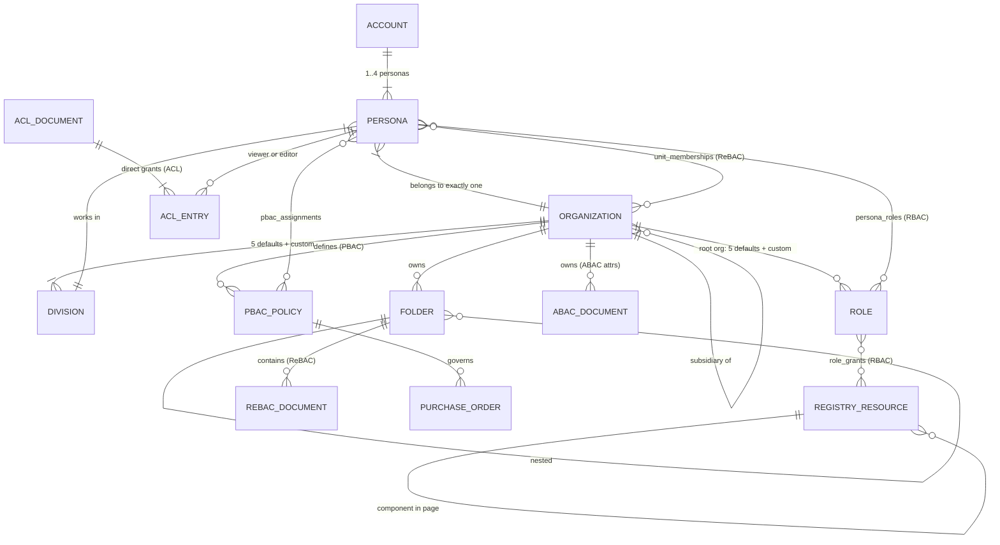
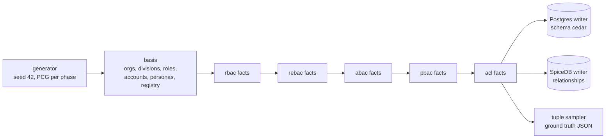

# 01 — Use Case: "Nusantara ERP" and the Benchmark Dataset

> Part of the [documentation index](../README.md). Next: [02 — Architecture](02-architecture.md) ·
> [03 — Benchmark Results](03-benchmark-results.md)

This benchmark does not use synthetic random tuples. It models a **complete, imagined enterprise
SaaS ERP** — "Nusantara ERP" — and generates every authorization fact from that domain, so both
engines answer *business questions*, not toy lookups.

## 1. The business context

**Nusantara ERP** is a multi-tenant SaaS ERP for the Indonesian market, serving **B2B and B2C**,
from warung-scale businesses up to conglomerates ("low to high market" — assume very enterprise).
Two levels of administration exist:

- **Platform level** — the SaaS owner's staff (application admins) who operate the platform itself.
- **Business level** — each customer organization's own owners/admins who manage their tenant.

### Organizations & subsidiaries
A tenant is a **root organization** that may own a tree of **subsidiaries** (depth ≤ 4). Access
often flows *down* this tree: a manager at the holding company needs visibility into a branch's
documents, never the other way around, and **never across tenants**.

Real generated example (a root and its subsidiary, from the seeded database):

| id | parent_id | depth | region | name |
|---|---|---|---|---|
| org-01001 | — | 0 | jakarta | PT Komodo Abadi 1001 |
| org-02526 | org-01001 | 1 | denpasar | PT Komodo Abadi 1001 Regional 2526 |

### Divisions & roles — defaults plus per-org customization
Every org node gets the **5 default divisions** (`finance`, `procurement`, `hr`, `sales`,
`operations`) and each **root org** gets the **5 default role types** (`owner`, `admin`, `manager`,
`staff`, `auditor`). Both are customizable per organization — real generated examples:

| custom division | org | custom role | org |
|---|---|---|---|
| `legal` (div-000005) | org-00000 | `branch-head` (role-000005) | org-00000 |
| `export-desk` (div-000006) | org-00000 | `account-executive` (role-000011) | org-00001 |

### Accounts & personas
End users hold a **root account**; each account has 1–4 **personas** (children of the account), and
**one persona belongs to exactly one organization node**, one division, and carries ABAC attributes
(clearance 1–4, employment type, region). Real generated examples:

| id | account | org | division | clearance | employment | region |
|---|---|---|---|---|---|---|
| psn-015173 | acc-015173 | org-03832 | finance | 3 | full-time | bandung |
| psn-225004 | acc-225004 | org-15572 | operations | 2 | full-time | makassar |

### The application-permission registry (5 microservices as metadata)
The ERP is imagined as **5 microservices** — `identity`, `finance`, `procurement`, `hr`, `sales` —
declared as *metadata* in [catalog/services.json](../catalog/services.json): **54 backend
endpoints**, **42 UI pages**, and **~420 UI components**, every single one a first-class permission
target (actions `execute` / `view` / `render`). IDs are derived as `ep/<svc>/<key>`,
`pg/<svc>/<key>`, `cmp/<svc>/<page>/<name>` — `/` instead of `:` because SpiceDB object IDs forbid
colons (gotcha G12 in [.issues/02_gotcha_20260709.md](../.issues/02_gotcha_20260709.md)).

## 2. Field conditions → the five access models

Each benchmarked model is a real condition in this ERP, not an abstract pattern:

| Model | Business scenario | Example check |
|---|---|---|
| **RBAC** | "Only finance managers may call the invoice-approve endpoint / see the payroll page / render the export button." Role grants over the app registry. | May `psn-000065` (role holder) `view` page `pg/sales/sales-dashboard`? |
| **ReBAC** | "A manager at the holding company sees the Surabaya branch's documents" — document → folder → org-unit → ancestor traversal; membership at an ancestor grants downward visibility. Cross-tenant access must be impossible. | May `psn-272633` `doc.view` `rdoc-000072` owned by a descendant unit? |
| **ABAC** | "Confidential (classification 3) finance documents are readable only by finance staff with clearance ≥ 3, and archived documents by no one." Pure attribute comparison. | May a clearance-2 operations persona read a classification-3 finance doc? (deny) |
| **PBAC** | "Each organization defines its own approval policies: *finance POs up to Rp 487jt, only in Medan/Denpasar*." Policy rows are data, assigned to personas; amount/region arrive at request time. | May `psn-015173` `po.approve` `po-000122` for Rp 486.452.549 in `medan`? (allow — see the real policy below) |
| **ACL** | "Share this document with these two people" — direct per-resource grants, editors can also view. | May a persona with only a `view` entry `acl.edit`? (deny) |

Real generated PBAC policy governing `po-000122`:

| id | org | name | division | max_amount | regions | active |
|---|---|---|---|---|---|---|
| pol-034255 | org-01712 | approval-policy-15 | finance | 487.000.000 | {medan, denpasar} | true |

## 3. The domain model

## 4. Data generation — deterministic, dual-engine, ground-truthed

The entire dataset is produced by **one deterministic generator**
([internal/seed/generator.go](../internal/seed/generator.go)) using a fixed-seed PCG PRNG
(`-seed 42`) with an **independent stream per phase**, so the same seed always yields the
byte-identical dataset — and the same stream feeds three interchangeable sinks: the Postgres writer
(Cedar's data), the SpiceDB writer (relationships), and the ground-truth **tuple sampler**.

### Row budgets (FullScale, ≥1M countable rows per model per engine)
Defined in [internal/seed/types.go](../internal/seed/types.go) (`FullScale()`), verified against the
seeded database:

| Slice | Budget | Countable per model |
|---|---|---|
| Root orgs → org nodes | 2.000 → 20.000 (depth ≤ 4) | basis |
| Divisions / roles | ~140k / ~15k (+5 platform types) | basis |
| Accounts → personas | 300k → 480k | basis |
| RBAC: persona_roles + role_grants | ~1.008M + ~120k | **1.13M** |
| ReBAC: docs + folders + memberships + org edges | 600k + 120k + 520k + 18k | **1.26M** |
| ABAC: attribute documents | 1.000.000 | **1.00M** |
| PBAC: assignments + PO links + policies | 700k + 300k + 40k | **1.04M** |
| ACL: direct entries (350k docs × 3) | 1.050.000 | **1.05M** |

### Seeded totals — exact counts, verified against both engines

Queried directly from the seeded database (seed 42, FullScale; SpiceDB counts are **live**
relationships — its MVCC keeps deleted tuples as tombstones until GC, so naive `count(*)` on
`relation_tuple` over-counts):

| Use case | Cedar rows (schema `cedar`) | SpiceDB live relationships | Combined | Note |
|---|---:|---:|---:|---|
| RBAC | 1,127,901 (persona_roles 1,007,861 + role_grants 120,040) | **1,127,901** (role 1,007,861 + endpoint 12,544 + page 9,849 + component 97,647) | **2,255,802** | exact match |
| ReBAC | 1,257,336 (docs 600,000 + folders 120,000 + memberships 519,336 + org edges 18,000) | 1,307,389 (rebac_document 600,000 + folder 170,053 + org_unit 537,336) | **2,564,725** | +50,053 on SpiceDB: folder-parent is a column in Postgres but a separate edge in SpiceDB |
| ABAC | 1,000,000 | **1,000,000** | **2,000,000** | exact match |
| PBAC | 1,041,167 (assignments 701,167 + POs 300,000 + policies 40,000) | 1,001,167 (pbac_policy 701,167 + purchase_order 300,000) | **2,042,334** | −40,000 on SpiceDB: policy parameters live as caveat context on PO edges, not as rows |
| ACL | 1,050,000 (acl_entries) | **1,050,000** | **2,100,000** | exact match |
| Basis (identity + registry) | 1,287,476 (root orgs 2,000 · divisions 139,955 · roles 15,005 · accounts 300,000 · personas 480,000 · acl_documents 350,000 · registry 516 — the other 18,000 org rows are already counted as ReBAC edges) | — (identity facts enter as memberships/assignees above) | 1,287,476 | Cedar-only tables |
| **Total** | **6,763,880 rows** | **5,486,457 relationships** | **12,250,337** | one Postgres server, two schemas |

### Operational properties
- **Never at container start** — [db/bootstrap.sh](../db/bootstrap.sh) only creates roles/schemas;
  all data arrives via `make seed` ([cmd/authz-seed/main.go](../cmd/authz-seed/main.go)).
- **Batched 1000** records per write on both engines, with progress (rate + ETA) per phase.
- **Resumable** — per-phase checkpoints carry a `seed=… scale=…` fingerprint; resuming under
  different parameters is refused (IDs overlap across scales — gotcha G13/G17), use `-wipe`.
- **Ground truth** — the sampler ([internal/seed/sampler.go](../internal/seed/sampler.go)) emits
  42.836 tuples with *known* expected decisions (the generator created the facts), including
  adversarial denies: cross-tenant personas, insufficient clearance, over-limit amounts, archived
  documents, viewer-tries-to-edit. These drive the equivalence gate and the benchmark
  (see [03 — Benchmark Results](03-benchmark-results.md)).

## Related files

| File | Role |
|---|---|
| [catalog/services.json](../catalog/services.json) | The 5-microservice app-permission registry (metadata) |
| [internal/seed/types.go](../internal/seed/types.go) | Scale budgets + canonical record types |
| [internal/seed/generator.go](../internal/seed/generator.go) | Deterministic domain generator (basis + per-model streams) |
| [internal/seed/sampler.go](../internal/seed/sampler.go) | Ground-truth tuple sampling (allow/deny scenarios) |
| [internal/catalog/catalog.go](../internal/catalog/catalog.go) | Catalog loader |
| [cmd/authz-seed/main.go](../cmd/authz-seed/main.go) | Seeder CLI (`-engine`, `-scale`, `-wipe`, `-resume`) |
| [db/bootstrap.sh](../db/bootstrap.sh) | Roles/schemas only — never data |
| [.issues/02_gotcha_20260709.md](../.issues/02_gotcha_20260709.md) | Non-obvious traps found while building (G11–G18) |
