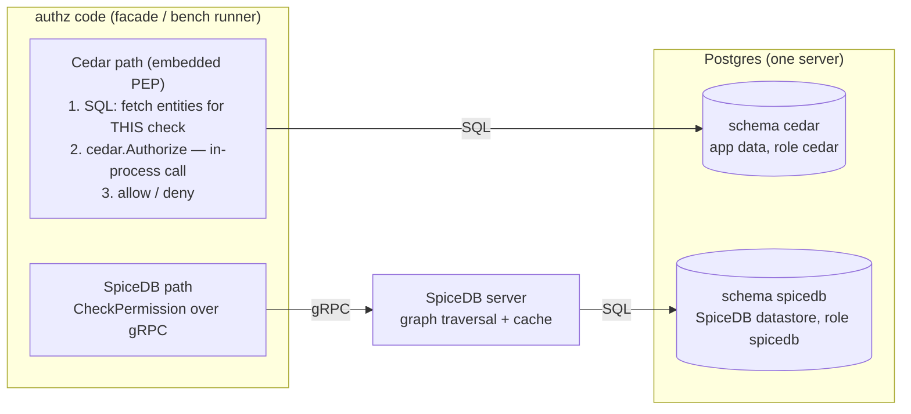
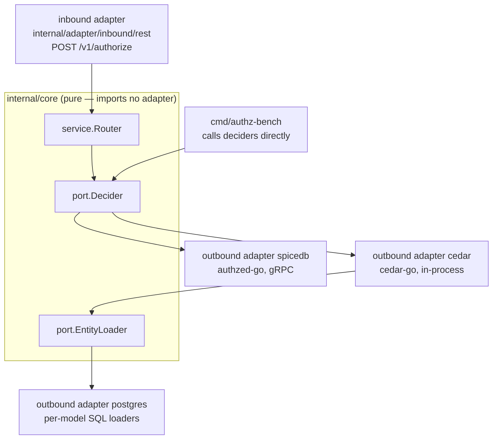
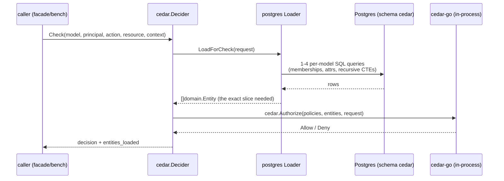
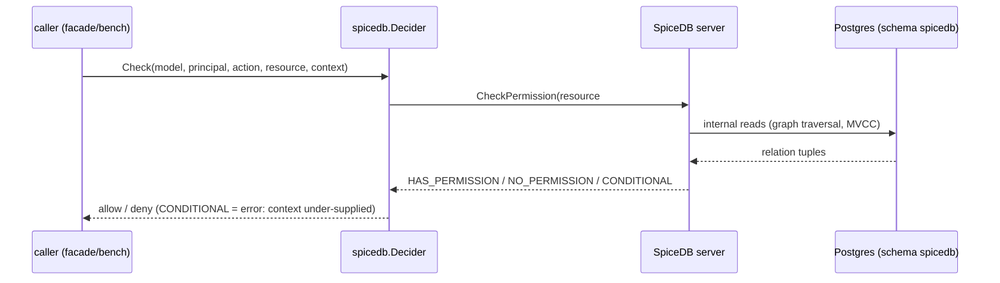
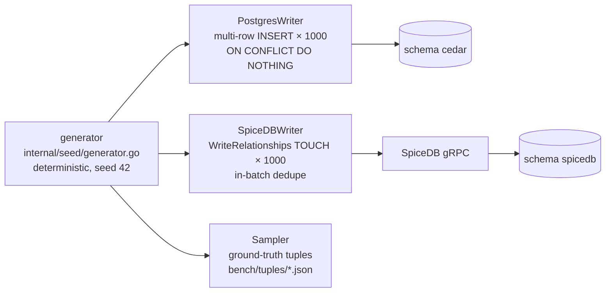

# 02 — Architecture: Cedar & SpiceDB Schemas, and How Both Engines Work

> Part of the [documentation index](../README.md). Previous: [01 — Use Case](01-use-case.md) ·
> Next: [03 — Benchmark Results](03-benchmark-results.md)

## 1. Two engines, two fundamentally different shapes

**Cedar is a library.** It runs *inside* your service, stores nothing, and must be handed the
relevant `entities` on every call. The data fetch is the application's job.

**SpiceDB is a server.** It *owns* its datastore, does graph traversal and caching internally, and
answers `CheckPermission` over gRPC. The data fetch is the engine's job.

Both persist to the **same Postgres server**, isolated by schema + database role:



### Schema isolation on one server (not an official SpiceDB feature)
SpiceDB issues unqualified table names, so [db/bootstrap.sh](../db/bootstrap.sh) routes each engine
into its own schema **on the Postgres side**:

```sql
ALTER ROLE cedar   IN DATABASE authz SET search_path = cedar;
ALTER ROLE spicedb IN DATABASE authz SET search_path = spicedb;
REVOKE CREATE ON SCHEMA public FROM PUBLIC;
```

Verified by smoke test: after `spicedb datastore migrate head`, all 9 SpiceDB tables land in schema
`spicedb`, none in `public`/`cedar`. This is a Postgres mechanism, not a SpiceDB feature — re-check
after every SpiceDB upgrade (gotcha G3). Fallback: two databases on the same server.

## 2. Hexagonal layout — both engines behind one port



Both engines implement `port.Decider` ([internal/core/port/ports.go](../internal/core/port/ports.go));
swapping or adding an engine is a new adapter, the core never changes.

## 3. One check, step by step

### Cedar (embedded) — data fetch is on the PEP



Per-model loaders live in [internal/adapter/outbound/postgres/loader.go](../internal/adapter/outbound/postgres/loader.go):
RBAC loads the persona's roles + the resource's granted roles; ReBAC walks folder and org-unit
chains with recursive CTEs; ABAC loads both sides' attributes; PBAC loads the governing policy
entity + the persona's assignments; ACL loads the document's viewer/editor sets.

### SpiceDB (server) — data fetch is inside the engine



The adapter ([internal/adapter/outbound/spicedb/decider.go](../internal/adapter/outbound/spicedb/decider.go))
is instantiated once per consistency mode: `fully_consistent` (bypasses cache — fairest vs Cedar's
live reads) and `minimize_latency` (production default, ~5s quantized cache).

## 4. The twin schemas — apple-to-apple per model

The Cedar policies ([policies/](../policies/), one file per model) and the SpiceDB schema
([schema/spicedb/schema.zed](../schema/spicedb/schema.zed)) encode the **same semantics**; any
change to one side must be mirrored on the other and re-verified (`make verify`).

| Model | Question | Cedar realization | SpiceDB realization |
|---|---|---|---|
| RBAC | May P execute/view/render registry resource X? | persona's roles = entity **Parents**; resource attr `allowed_roles` (set of Role refs); one generic rule `principal in resource.allowed_roles` — [policies/rbac.cedar](../policies/rbac.cedar) | `role#assignee@persona`; `endpoint/page/component#allowed_role@role#assignee`; `permission execute = allowed_role` |
| ReBAC | May P view doc D via folder → unit → ancestors (or a SHARED unit)? | Parents graph doc→folder→unit(s)→parent-units — shared folders carry a second OrgUnit parent; persona attr `member_of`; rule `resource in principal.member_of` — [policies/rebac.cedar](../policies/rebac.cedar) | arrows: `rebac_document.folder->view`, `folder = unit->view_docs + parent->view` (shared folders have TWO `unit` relationships), `org_unit.view_docs = member + manager + parent->view_docs` |
| ABAC | May P (clearance, division, region) read D (classification, division, status, region)? | attribute comparison incl. **data residency** (`region match OR clearance == 4`) + `forbid` on `status == "archived"` — [policies/abac.cedar](../policies/abac.cedar) | CEL caveat `doc_attrs` on a wildcard `reader: persona:*`; document attrs (incl. region) = **static caveat context**, principal attrs (incl. `principal_region`) at check time |
| PBAC | May P approve PO N (amount, region) under its governing policy? | **policy-parameter entities** — policy rows become entities with `{active, min_amount, max_amount, regions}`; `principal in resource.policy && min ≤ context.amount ≤ max …` — [policies/pbac.cedar](../policies/pbac.cedar) | caveat `po_limits` on `purchase_order#governed_by@pbac_policy` with policy params (incl. `min_amount`) as static context; `permission approve = governed_by->assignee` |
| ACL | May P view/edit D via direct grant? | resource attrs `viewers`/`editors` (entity sets), `.contains(principal)`; **editors can also view** — [policies/acl.cedar](../policies/acl.cedar) | `acl_document#viewer/#editor@persona`; `permission view = viewer + editor` |

Two design decisions worth knowing:

- **PBAC uses parameter entities, not policy text** — cedar-go 1.8.0 has no policy templates, and
  compiling 40k policy rows into 40k policies would be pathological. One generic rule reads the
  policy row (loaded as an entity) via chained attribute access (`resource.policy.max_amount`) —
  pinned by a unit test in [internal/adapter/outbound/cedar/engine_test.go](../internal/adapter/outbound/cedar/engine_test.go).
- **Caveat context merge rule** — SpiceDB merges relationship-static context (wins) with check-time
  context. Policy/document parameters are written once at seed time; volatile facts
  (amount, region, clearance) arrive per check. A `CONDITIONAL` answer means the caller
  under-supplied context and is treated as an error everywhere.

## 5. Seeding pipeline — one stream, three sinks



- Batch size is **1000 on both engines** — deliberately equal, and it is exactly SpiceDB's default
  `WriteRelationships` cap.
- The faster `ImportBulkRelationships` (binary COPY) is **not** used: it breaks against Postgres 18
  with `protocol synchronization was lost (08P01)` — gotcha G1 in
  [.issues/01_gotcha_20260709.md](../.issues/01_gotcha_20260709.md). TOUCH-writes are idempotent,
  making re-runs/resume safe on both sides.
- The SpiceDB writer dedupes relationships **within a batch** (WriteRelationships rejects in-request
  duplicates) — see [internal/seed/writer_spicedb.go](../internal/seed/writer_spicedb.go).

## 6. The runtime surface

The facade ([cmd/authz-service/main.go](../cmd/authz-service/main.go) +
[internal/adapter/inbound/rest/handler.go](../internal/adapter/inbound/rest/handler.go)) exposes one
endpoint that selects the engine per request:

```json
POST /v1/authorize
{ "engine": "cedar | spicedb | spicedb-fully_consistent",
  "model": "rbac | rebac | abac | pbac | acl",
  "principal": "psn-…", "action": "…", "resource_type": "…", "resource": "…",
  "context": { "amount": 25000000, "region": "jakarta" } }
```

Caller mistakes return 400; backend faults return a generic 502 (details stay in the server log).
Ready-made allow/deny examples per engine × model live in [http/](../http/) (10 files), including
raw SpiceDB HTTP-gateway calls that bypass this repo's code entirely.

## Related files

| File | Role |
|---|---|
| [policies/](../policies/) | Cedar policy set — one data-driven file per model |
| [schema/spicedb/schema.zed](../schema/spicedb/schema.zed) | SpiceDB definitions + caveats (`doc_attrs`, `po_limits`) |
| [internal/core/](../internal/core/) | Domain, ports (`Decider`, `EntityLoader`), router — pure hexagonal core |
| [internal/adapter/outbound/cedar/engine.go](../internal/adapter/outbound/cedar/engine.go) | Embedded engine adapter (+ `Prepare`/`EvaluatePrepared` for engine-only timing) |
| [internal/adapter/outbound/postgres/loader.go](../internal/adapter/outbound/postgres/loader.go) | Per-model entity loaders (the "glue" Cedar makes you build) |
| [internal/adapter/outbound/spicedb/decider.go](../internal/adapter/outbound/spicedb/decider.go) | gRPC CheckPermission adapter, consistency mode per instance |
| [internal/seed/writer_postgres.go](../internal/seed/writer_postgres.go) / [writer_spicedb.go](../internal/seed/writer_spicedb.go) | The two engine writers (batch 1000) |
| [docker-compose.yml](../docker-compose.yml) | postgres → spicedb-migrate → spicedb → facade |
| [db/bootstrap.sh](../db/bootstrap.sh) | Roles, schemas, search_path — the isolation mechanism |
