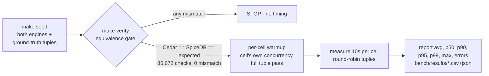

# 03 — Benchmark Results: Scenarios, Methodology, Numbers

> Part of the [documentation index](../README.md). Previous: [01 — Use Case](01-use-case.md) ·
> [02 — Architecture](02-architecture.md)

Snapshot of run **`20260709-153834`** (2026-07-09). `bench/` is gitignored — every number below is
reproducible: `make up && make seed && make verify && make bench` (deterministic dataset, seed 42).

## 1. Scenarios — ground-truth tuples, not random noise

The query mix is **42,836 tuples** sampled by the data generator itself
([internal/seed/sampler.go](../internal/seed/sampler.go)), so every tuple carries a **known expected
decision** — including adversarial denies that specifically probe each model's failure modes:

| Model | Tuples | Allow / Deny | Deny variants (adversarial) |
|---|---:|---:|---|
| RBAC | 9,696 | 4,848 / 4,848 | resource granted to none of the persona's roles |
| ReBAC | 10,000 | 5,000 / 5,000 | persona from a **different tenant** (no relationship path exists) |
| ABAC | 4,904 | 396 / 4,508 | clearance too low · wrong division · archived document |
| PBAC | 8,236 | 4,426 / 3,810 | amount over limit · region outside policy · not an assignee · inactive policy |
| ACL | 10,000 | 5,000 / 5,000 | viewer attempting `acl.edit` · persona with no entry at all |

ABAC deny tuples always use the persona's TRUE attributes (never fabricated context), so both
engines judge identical facts. Regenerate anytime with `make seed-tuples` — same seed, same files.

## 2. Methodology

**Cells:** 5 models × 4 engine-variants × concurrency {1, 8, 32} = **60 cells**, 10s each, all with
**0 errors**. The four engine-variants:

| Cell | What it measures |
|---|---|
| `cedar` | **End-to-end embedded PEP**: Postgres entity fetch (1–4 queries) + in-process evaluation — the honest cost when the data fetch is your job |
| `cedar-eval` | **Engine only**: entities pre-fetched and pre-converted ([Prepare/EvaluatePrepared](../internal/adapter/outbound/cedar/engine.go)); the timed call is purely `cedar.Authorize` |
| `spicedb-fully_consistent` | gRPC check with cache bypassed — fairest against Cedar's live reads |
| `spicedb-minimize_latency` | SpiceDB's production default (quantized cache, ~5s window). **Best case**: the fixed working set makes this effectively a cache-hit measurement |

**Fairness rules** (each one exists because getting it wrong changed the numbers — see history):
- Cedar's pgx pool is sized **above** the max bench concurrency (`pool_max_conns=48` ≥ 32);
  pgxpool's NumCPU default would have measured client-side pool queueing.
- Warmup runs at the cell's own concurrency and covers the **full tuple set** — no cold
  connections or first-reads inside any timed window, on either engine.
- Errored checks are excluded from latency AND throughput (fast failures must not flatter).
- Percentiles come from per-worker preallocated reservoirs (no mid-measurement realloc/GC noise);
  mean and max are exact over all checks.
- Known asymmetry (documented, inherent): for ABAC/PBAC, SpiceDB receives principal attributes /
  amount / region as check-time context, while Cedar fetches everything from Postgres (gotcha G15).

## 3. Environment

| Component | Value |
|---|---|
| Host | 16 CPU cores, Linux, single machine (client + both engines + Postgres) |
| Postgres | `postgres:18.4` (Docker), one server, schemas `cedar` / `spicedb` |
| SpiceDB | `authzed/spicedb:v1.54.0`, gRPC, Postgres datastore |
| Go / libs | Go 1.26.4 · cedar-go v1.8.0 · authzed-go v1.10.0 · pgx v5.10.0 |
| Dataset | Cedar **6,763,880** rows · SpiceDB **5,486,457** live relationships = **12,250,337** combined (≥1M per model per engine — exact per-model breakdown in [01 — Use Case](01-use-case.md#seeded-totals--exact-counts-verified-against-both-engines)) |
| Gate | 42,836 tuples × 2 engines = 85,672 checks, **0 mismatch / 0 error** |

## 4. Results (latency in µs; thr = checks/second)

### RBAC — app-registry permission via roles

| Engine | conc | thr | avg | p50 | p90 | p95 | p99 |
|---|---:|---:|---:|---:|---:|---:|---:|
| cedar | 1 | 996 | 1,004 | 984 | 1,155 | 1,226 | 1,421 |
| cedar | 8 | 5,477 | 1,460 | 1,351 | 1,752 | 2,018 | 3,586 |
| cedar | 32 | 8,042 | 3,978 | 3,678 | 5,416 | 6,298 | 10,539 |
| cedar-eval | 1 | 54,435 | 18.3 | 16.4 | 24.9 | 28.8 | 61.8 |
| cedar-eval | 8 | 239,892 | 33.2 | 27.5 | 64.2 | 69.3 | 80.9 |
| cedar-eval | 32 | 295,261 | 108 | 30.9 | 70.0 | 78.8 | 190 |
| spicedb-fully_consistent | 1 | 383 | 2,611 | 2,528 | 2,969 | 3,175 | 4,829 |
| spicedb-fully_consistent | 8 | 1,458 | 5,487 | 5,145 | 7,714 | 8,796 | 11,164 |
| spicedb-fully_consistent | 32 | 1,764 | 18,125 | 17,424 | 25,449 | 28,245 | 34,240 |
| spicedb-minimize_latency | 1 | 432 | 2,315 | 2,240 | 2,668 | 2,863 | 4,167 |
| spicedb-minimize_latency | 8 | 1,514 | 5,283 | 4,970 | 7,501 | 8,532 | 11,017 |
| spicedb-minimize_latency | 32 | 1,829 | 17,490 | 16,801 | 23,577 | 25,920 | 30,809 |

### ReBAC — document → folder → org-unit → ancestor graph

| Engine | conc | thr | avg | p50 | p90 | p95 | p99 |
|---|---:|---:|---:|---:|---:|---:|---:|
| cedar | 1 | 757 | 1,321 | 1,306 | 1,502 | 1,567 | 1,729 |
| cedar | 8 | 4,598 | 1,739 | 1,686 | 1,931 | 2,058 | 3,223 |
| cedar | 32 | 7,232 | 4,424 | 4,237 | 5,505 | 6,218 | 8,657 |
| cedar-eval | 1 | 394,881 | 2.5 | 2.2 | 3.3 | 3.9 | 6.6 |
| cedar-eval | 8 | 2,013,609 | 3.8 | 3.2 | 5.6 | 8.2 | 11.0 |
| cedar-eval | 32 | 2,331,370 | 13.5 | 4.4 | 9.0 | 10.3 | 18.8 |
| spicedb-fully_consistent | 1 | 392 | 2,552 | 2,469 | 3,200 | 3,427 | 4,247 |
| spicedb-fully_consistent | 8 | 1,275 | 6,272 | 5,895 | 9,237 | 10,496 | 13,423 |
| spicedb-fully_consistent | 32 | 1,521 | 21,029 | 20,340 | 30,006 | 33,236 | 39,191 |
| spicedb-minimize_latency | 1 | 450 | 2,222 | 2,141 | 2,820 | 3,082 | 3,967 |
| spicedb-minimize_latency | 8 | 1,421 | 5,627 | 5,373 | 8,230 | 9,244 | 11,253 |
| spicedb-minimize_latency | 32 | 1,579 | 20,251 | 19,494 | 28,814 | 32,075 | 38,120 |

### ABAC — attribute comparison (clearance/division/status)

| Engine | conc | thr | avg | p50 | p90 | p95 | p99 |
|---|---:|---:|---:|---:|---:|---:|---:|
| cedar | 1 | 1,831 | 546 | 537 | 636 | 668 | 736 |
| cedar | 8 | 9,611 | 832 | 790 | 983 | 1,095 | 1,761 |
| cedar | 32 | 15,832 | 2,021 | 1,959 | 2,527 | 2,820 | 4,071 |
| cedar-eval | 1 | 773,028 | 1.2 | 1.1 | 1.5 | 1.9 | 2.8 |
| cedar-eval | 8 | 4,222,492 | 1.8 | 1.6 | 2.4 | 2.7 | 6.5 |
| cedar-eval | 32 | 5,352,600 | 5.7 | 2.0 | 3.1 | 6.2 | 8.3 |
| spicedb-fully_consistent | 1 | 519 | 1,926 | 1,853 | 2,257 | 2,435 | 3,217 |
| spicedb-fully_consistent | 8 | 4,731 | 1,691 | 1,492 | 2,604 | 3,067 | 4,339 |
| spicedb-fully_consistent | 32 | 9,461 | 3,382 | 2,881 | 5,886 | 7,132 | 10,319 |
| spicedb-minimize_latency | 1 | 693 | 1,444 | 1,489 | 1,728 | 1,858 | 2,458 |
| spicedb-minimize_latency | 8 | 5,601 | 1,428 | 1,144 | 2,387 | 2,906 | 4,272 |
| spicedb-minimize_latency | 32 | 9,787 | 3,268 | 2,738 | 5,726 | 7,072 | 10,254 |

### PBAC — org-defined approval policies (params + request context)

| Engine | conc | thr | avg | p50 | p90 | p95 | p99 |
|---|---:|---:|---:|---:|---:|---:|---:|
| cedar | 1 | 1,202 | 832 | 814 | 975 | 1,031 | 1,208 |
| cedar | 8 | 6,729 | 1,189 | 1,139 | 1,350 | 1,456 | 2,393 |
| cedar | 32 | 10,412 | 3,072 | 2,978 | 3,758 | 4,193 | 5,798 |
| cedar-eval | 1 | 552,106 | 1.7 | 1.6 | 2.2 | 2.7 | 3.8 |
| cedar-eval | 8 | 3,381,457 | 2.2 | 1.9 | 3.0 | 3.4 | 7.1 |
| cedar-eval | 32 | 4,240,565 | 7.3 | 2.7 | 4.0 | 6.6 | 8.9 |
| spicedb-fully_consistent | 1 | 548 | 1,826 | 1,853 | 2,363 | 2,696 | 3,471 |
| spicedb-fully_consistent | 8 | 4,038 | 1,981 | 1,822 | 3,120 | 3,678 | 5,264 |
| spicedb-fully_consistent | 32 | 8,292 | 3,858 | 3,263 | 6,811 | 8,369 | 11,696 |
| spicedb-minimize_latency | 1 | 659 | 1,517 | 1,546 | 2,082 | 2,492 | 3,193 |
| spicedb-minimize_latency | 8 | 4,901 | 1,632 | 1,427 | 2,686 | 3,205 | 4,604 |
| spicedb-minimize_latency | 32 | 8,847 | 3,616 | 2,992 | 6,455 | 7,941 | 11,043 |

### ACL — direct per-resource grants

| Engine | conc | thr | avg | p50 | p90 | p95 | p99 |
|---|---:|---:|---:|---:|---:|---:|---:|
| cedar | 1 | 3,224 | 310 | 292 | 358 | 405 | 772 |
| cedar | 8 | 18,322 | 436 | 395 | 540 | 669 | 1,341 |
| cedar | 32 | 29,419 | 1,088 | 1,024 | 1,533 | 1,799 | 2,688 |
| cedar-eval | 1 | 636,513 | 1.5 | 1.3 | 2.0 | 2.4 | 4.3 |
| cedar-eval | 8 | 3,516,218 | 2.1 | 1.9 | 2.7 | 3.2 | 7.8 |
| cedar-eval | 32 | 4,675,794 | 6.6 | 2.1 | 3.8 | 6.4 | 9.5 |
| spicedb-fully_consistent | 1 | 736 | 1,359 | 1,311 | 1,695 | 2,136 | 2,642 |
| spicedb-fully_consistent | 8 | 5,668 | 1,411 | 1,143 | 2,182 | 2,587 | 3,866 |
| spicedb-fully_consistent | 32 | 14,365 | 2,227 | 1,779 | 3,998 | 5,234 | 7,874 |
| spicedb-minimize_latency | 1 | 956 | 1,046 | 1,002 | 1,264 | 1,706 | 2,263 |
| spicedb-minimize_latency | 8 | 7,253 | 1,103 | 963 | 1,788 | 2,171 | 3,204 |
| spicedb-minimize_latency | 32 | 15,664 | 2,042 | 1,645 | 3,683 | 4,695 | 6,968 |

## 5. Reading the results

- **Cedar's engine is effectively free** — `cedar-eval` p50 is 1–31µs (up to ~5.3M checks/s at
  c=32 for ABAC). The real cost of the embedded pattern is the **data fetch**: end-to-end Cedar is
  300–1,000× slower than eval-only, entirely due to Postgres round-trips. This quantifies the
  repo's founding thesis: *with Cedar, the glue is your job* — and the glue is where the time goes.
- **End-to-end at c=1, Cedar leads every model by ~1.9–4.5×**: e.g. ACL 292µs vs 1,002–1,311µs;
  ABAC 537µs vs 1,489–1,853µs; RBAC 984µs vs 2,240–2,528µs. One in-process eval plus tight indexed
  SQL beats a gRPC hop + server-side resolution at this dataset size.
- **ReBAC is the widest gap under load**: at c=32, Cedar sustains 7,232 checks/s (p50 4.2ms) vs
  SpiceDB's ~1,520–1,579/s (p50 ~20ms) — recursive CTEs over indexed folder/org chains outpace
  uncached graph traversal here. This is also SpiceDB's hardest workload shape at this scale.
- **SpiceDB's cache buys ~10–20%** (`minimize_latency` vs `fully_consistent`) on this fixed working
  set — its best case. Real mixed workloads would sit between the two modes; both are reported for
  that reason.
- **Scaling behavior differs**: SpiceDB's throughput grows steadily with concurrency on
  attribute-style models (ABAC/PBAC/ACL roughly ×13–20 from c=1 to c=32), narrowing Cedar's lead;
  RBAC/ReBAC saturate early (~×4). Cedar end-to-end scales ~×8–9 (bounded by per-check Postgres
  round-trips).
- Interpretation limits: single host (no real network hop), client and engines share CPUs at c=32,
  ~10s cells, and the ABAC/PBAC context asymmetry (G15). Numbers compare *shapes*, not absolute
  production capacity.

## 6. History & integrity

- The **first timing run was discarded**: an adversarial review found the harness measuring
  client-side artifacts (pgx pool capped below bench concurrency, single-threaded warmup,
  errored-check timing) — fixed as gotcha G16 in
  [.issues/02_gotcha_20260709.md](../.issues/02_gotcha_20260709.md), gate re-passed, benchmark
  re-run. The published run is the fixed harness.
- Raw artifacts per run: `bench/results/<timestamp>.csv` and `.json` (gitignored; regenerate with
  `make bench`).

## Related files

| File | Role |
|---|---|
| [internal/bench/bench.go](../internal/bench/bench.go) | Measurement harness: gate, warmup, reservoir percentiles, error exclusion |
| [cmd/authz-bench/main.go](../cmd/authz-bench/main.go) | CLI: `-mode verify` (gate) / `-mode run` (60 cells), CSV/JSON reports |
| [internal/seed/sampler.go](../internal/seed/sampler.go) | Ground-truth tuple sampling (the scenarios) |
| [internal/adapter/outbound/cedar/engine.go](../internal/adapter/outbound/cedar/engine.go) | `Prepare`/`EvaluatePrepared` — what `cedar-eval` times |
| [internal/adapter/outbound/spicedb/decider.go](../internal/adapter/outbound/spicedb/decider.go) | Consistency modes measured separately |
| [http/](../http/) | Replay any scenario by hand (10 files, allow + deny per engine × model) |
| [Makefile](../Makefile) | `seed` / `verify` / `bench` orchestration |
