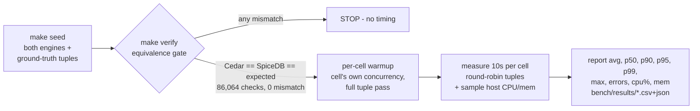

# 03 — Benchmark Results: Scenarios, Methodology, Numbers

> Part of the [documentation index](../README.md). Previous: [01 — Use Case](01-use-case.md) ·
> [02 — Architecture](02-architecture.md)

Snapshot of run **`20260709-214028`** (2026-07-09). The `bench/` artifacts are committed — every number below
is reproducible: `make up && make seed && make verify && make bench` (deterministic dataset, seed 42).

## 1. Scenarios — ground-truth tuples, not random noise

The query mix is **43,032 tuples** sampled by the data generator itself
([internal/seed/sampler.go](../internal/seed/sampler.go)), so every tuple carries a **known expected
decision** — including adversarial denies that specifically probe each model's failure modes:

| Model | Tuples | Allow / Deny | Deny variants (adversarial) |
|---|---:|---:|---|
| RBAC | 9,924 | 4,962 / 4,962 | resource granted to none of the persona's roles |
| ReBAC | 9,848 | 4,924 / 4,924 | persona from a **different tenant** (no relationship path exists) |
| ABAC | 4,897 | 196 / 4,701 | clearance too low · wrong division · **wrong region (data residency)** · archived document |
| PBAC | 8,367 | 4,350 / 4,017 | amount over ceiling · **amount below floor (petty cash)** · region outside policy · not an assignee · inactive policy |
| ACL | 9,996 | 4,998 / 4,998 | viewer attempting `acl.edit` · persona with no entry at all |

ABAC deny tuples always use the persona's TRUE attributes (never fabricated context), so both
engines judge identical facts. Regenerate anytime with `make seed-tuples` — same seed, same files.

## 2. Methodology

**Cells:** 5 models × 4 engine-variants × concurrency {1, 8, 32} = **60 cells**, 10s each, all with
**0 errors**. The four engine-variants:

| Cell | What it measures |
|---|---|
| `cedar` | **End-to-end embedded PEP**: Postgres entity fetch (1–4 queries) + in-process evaluation — the honest cost when the data fetch is your job |
| `cedar-eval` | **Engine only**: entities pre-fetched and pre-converted ([Prepare/EvaluatePrepared](../internal/adapter/outbound/cedar/engine.go)); the timed call is purely `cedar.Authorize` |
| `spicedb-fully_consistent` | gRPC check with cache bypassed — fairest against Cedar's live reads |
| `spicedb-minimize_latency` | SpiceDB's production default (quantized cache, ~5s window). **Best case**: the fixed working set makes this effectively a cache-hit measurement |

**Fairness rules** (each one exists because getting it wrong changed the numbers — see history):
- Cedar's pgx pool is sized **above** the max bench concurrency (`pool_max_conns=48` ≥ 32);
  pgxpool's NumCPU default would have measured client-side pool queueing.
- Warmup runs at the cell's own concurrency and covers the **full tuple set** — no cold
  connections or first-reads inside any timed window, on either engine.
- Errored checks are excluded from latency AND throughput (fast failures must not flatter).
- Percentiles come from per-worker preallocated reservoirs (no mid-measurement realloc/GC noise);
  mean and max are exact over all checks.
- **Host CPU and memory are sampled every 500ms across each cell's timed window**
  ([internal/bench/resources.go](../internal/bench/resources.go)) and reported per cell (avg/max) —
  so a throughput number is never read without the machine load that produced it.
- Known asymmetry (documented, inherent): for ABAC/PBAC, SpiceDB receives principal attributes /
  amount / region as check-time context, while Cedar fetches everything from Postgres (gotcha G6).

### What "latency" measures here
Every latency figure is **wall-clock time measured in the Go benchmark client**, wrapping the entire
check call ([internal/bench/bench.go](../internal/bench/bench.go): `t0 := time.Now(); fn(...);
lat := time.Since(t0)`). It is **not** SpiceDB's internally reported latency, and **not** an isolated
pg-query time:

- **`cedar`** times the whole embedded path — the Postgres entity fetch (pgx round-trips, including
  the recursive CTEs) *plus* `cedar.Authorize`. The SQL cost is inside the number, because in the
  embedded pattern your service pays it.
- **`spicedb-fully_consistent` / `spicedb-minimize_latency`** time the full gRPC `CheckPermission`
  round-trip **as the client observes it** — request serialization, transport, and SpiceDB's own
  internal datastore/cache reads all sit inside the measured window (timed from Go, not from
  SpiceDB's server-side metrics).
- **`cedar-eval`** times `cedar.Authorize` only, with entities pre-fetched — it performs **no I/O**.
  It is a *reference* that isolates raw engine cost; it is **not** a peer of any SpiceDB mode, because
  SpiceDB always crosses gRPC and reads its store, so no SpiceDB number can be "engine only".

So the honest head-to-head is **`cedar` vs the two `spicedb` modes** — both include the data read.
`cedar-eval` exists only to quantify how much of Cedar's end-to-end time is the Postgres round-trip
(the *glue cost*). Because everything runs on one host, "network" here is loopback; a real deployment
would add a network hop to the SpiceDB numbers.

## 3. Environment

| Component | Value |
|---|---|
| Host CPU | Intel Core **i9-9900K @ 3.60GHz**, 16 logical cores |
| Host RAM | **60.5 GB** total (single machine runs client + both engines + Postgres) |
| OS / Go | Linux · Go **1.26.4** |
| Postgres | `postgres:18.4` (Docker), one server, schemas `cedar` / `spicedb` |
| SpiceDB | `authzed/spicedb:v1.54.0`, gRPC, Postgres datastore |
| Libraries | cedar-go v1.8.0 · authzed-go v1.10.0 · pgx v5.10.0 |
| Dataset | Cedar **≈18.9M** rows · SpiceDB **15,983,008** live relationships ≈ **35M** combined (≥3M per model per engine — exact per-model breakdown in [01 — Use Case](01-use-case.md#seeded-totals--exact-counts-verified-against-both-engines)) |
| Gate | 43,032 tuples × 2 engines = 86,064 checks, **0 mismatch / 0 error** |

Because the client, both engines, and Postgres all share this one 16-core host, the CPU/mem columns
in the result tables below are **whole-machine** figures — at c=32 the load generator and the engine
under test are competing for the same cores, which is itself part of what the numbers show.

## 4. Results (latency in µs; thr = checks/second; cpu/mem = whole-host during the cell)

### RBAC — app-registry permission via roles

| Engine | conc | thr | avg | p50 | p90 | p95 | p99 | cpu% | mem GB |
|---|---:|---:|---:|---:|---:|---:|---:|---:|---:|
| cedar | 1 | 813 | 1,229 | 1,208 | 1,393 | 1,455 | 1,791 | 26 | 37.3 |
| cedar | 8 | 3,975 | 2,012 | 1,852 | 2,476 | 2,907 | 4,711 | 77 | 37.2 |
| cedar | 32 | 5,906 | 5,417 | 4,972 | 7,375 | 8,539 | 16,085 | 87 | 37.2 |
| cedar-eval | 1 | 27,011 | 36.9 | 33.0 | 44.3 | 56.8 | 130 | 20 | 37.4 |
| cedar-eval | 8 | 111,959 | 71.3 | 58.6 | 132 | 139 | 168 | 78 | 37.6 |
| cedar-eval | 32 | 127,605 | 250 | 67.5 | 160 | 199 | 1,232 | 95 | 37.9 |
| spicedb-fully_consistent | 1 | 333 | 3,004 | 2,886 | 3,425 | 3,773 | 6,203 | 40 | 37.9 |
| spicedb-fully_consistent | 8 | 967 | 8,274 | 7,831 | 11,738 | 13,257 | 16,578 | 68 | 38.0 |
| spicedb-fully_consistent | 32 | 1,108 | 28,840 | 28,058 | 39,733 | 43,094 | 49,054 | 70 | 38.0 |
| spicedb-minimize_latency | 1 | 372 | 2,691 | 2,569 | 3,076 | 3,425 | 5,673 | 40 | 37.4 |
| spicedb-minimize_latency | 8 | 1,037 | 7,715 | 7,327 | 11,021 | 12,293 | 15,337 | 70 | 37.3 |
| spicedb-minimize_latency | 32 | 1,105 | 28,939 | 27,840 | 37,867 | 41,172 | 46,964 | 72 | 37.4 |

### ReBAC — document → folder → org-unit → ancestor graph

| Engine | conc | thr | avg | p50 | p90 | p95 | p99 | cpu% | mem GB |
|---|---:|---:|---:|---:|---:|---:|---:|---:|---:|
| cedar | 1 | 778 | 1,285 | 1,265 | 1,498 | 1,566 | 1,769 | 30 | 37.4 |
| cedar | 8 | 4,368 | 1,831 | 1,756 | 2,085 | 2,289 | 3,578 | 78 | 36.5 |
| cedar | 32 | 7,026 | 4,554 | 4,351 | 5,718 | 6,441 | 8,907 | 87 | 36.4 |
| cedar-eval | 1 | 360,690 | 2.7 | 2.4 | 3.7 | 4.4 | 7.1 | 14 | 36.4 |
| cedar-eval | 8 | 1,853,264 | 4.2 | 3.5 | 6.2 | 8.6 | 11.9 | 65 | 36.4 |
| cedar-eval | 32 | 2,190,929 | 14.4 | 4.7 | 9.4 | 10.9 | 18.9 | 94 | 36.6 |
| spicedb-fully_consistent | 1 | 364 | 2,746 | 2,636 | 3,516 | 3,830 | 4,783 | 40 | 36.5 |
| spicedb-fully_consistent | 8 | 1,142 | 7,006 | 6,582 | 10,555 | 11,888 | 15,115 | 70 | 36.5 |
| spicedb-fully_consistent | 32 | 1,246 | 25,666 | 24,433 | 38,041 | 42,873 | 52,901 | 73 | 36.5 |
| spicedb-minimize_latency | 1 | 409 | 2,447 | 2,348 | 3,202 | 3,525 | 4,469 | 40 | 36.5 |
| spicedb-minimize_latency | 8 | 1,194 | 6,699 | 6,287 | 10,240 | 11,627 | 14,498 | 70 | 36.6 |
| spicedb-minimize_latency | 32 | 1,275 | 25,077 | 23,953 | 37,612 | 42,066 | 50,403 | 72 | 36.6 |

### ABAC — attribute comparison (clearance/division/status/region)

| Engine | conc | thr | avg | p50 | p90 | p95 | p99 | cpu% | mem GB |
|---|---:|---:|---:|---:|---:|---:|---:|---:|---:|
| cedar | 1 | 1,709 | 585 | 577 | 674 | 705 | 777 | 31 | 36.5 |
| cedar | 8 | 9,218 | 868 | 825 | 1,035 | 1,150 | 1,719 | 78 | 36.7 |
| cedar | 32 | 14,964 | 2,138 | 2,041 | 2,777 | 3,163 | 4,415 | 88 | 36.7 |
| cedar-eval | 1 | 637,018 | 1.5 | 1.3 | 2.0 | 2.4 | 3.3 | 17 | 36.7 |
| cedar-eval | 8 | 3,875,621 | 1.9 | 1.8 | 2.6 | 3.0 | 6.7 | 64 | 36.6 |
| cedar-eval | 32 | 4,958,086 | 6.2 | 2.1 | 3.4 | 6.3 | 8.5 | 96 | 36.6 |
| spicedb-fully_consistent | 1 | 530 | 1,888 | 1,846 | 2,085 | 2,192 | 2,733 | 32 | 36.5 |
| spicedb-fully_consistent | 8 | 4,480 | 1,785 | 1,558 | 2,753 | 3,292 | 4,901 | 68 | 36.5 |
| spicedb-fully_consistent | 32 | 8,606 | 3,718 | 3,157 | 6,553 | 7,978 | 10,936 | 72 | 36.5 |
| spicedb-minimize_latency | 1 | 783 | 1,278 | 1,450 | 1,713 | 1,804 | 2,178 | 31 | 36.5 |
| spicedb-minimize_latency | 8 | 5,460 | 1,465 | 1,185 | 2,430 | 2,934 | 4,268 | 68 | 36.5 |
| spicedb-minimize_latency | 32 | 8,933 | 3,581 | 2,996 | 6,358 | 7,769 | 11,163 | 74 | 36.5 |

### PBAC — org-defined approval policies (params + request context)

| Engine | conc | thr | avg | p50 | p90 | p95 | p99 | cpu% | mem GB |
|---|---:|---:|---:|---:|---:|---:|---:|---:|---:|
| cedar | 1 | 1,222 | 818 | 807 | 940 | 986 | 1,118 | 35 | 36.5 |
| cedar | 8 | 6,712 | 1,192 | 1,146 | 1,359 | 1,470 | 2,295 | 77 | 36.5 |
| cedar | 32 | 10,518 | 3,042 | 2,961 | 3,701 | 4,071 | 5,751 | 88 | 36.5 |
| cedar-eval | 1 | 509,923 | 1.9 | 1.8 | 2.3 | 2.7 | 4.1 | 13 | 36.6 |
| cedar-eval | 8 | 2,982,749 | 2.6 | 2.3 | 3.4 | 3.9 | 7.6 | 62 | 36.6 |
| cedar-eval | 32 | 3,875,294 | 8.0 | 3.0 | 4.3 | 6.9 | 9.3 | 97 | 36.7 |
| spicedb-fully_consistent | 1 | 607 | 1,646 | 1,752 | 2,058 | 2,183 | 2,658 | 37 | 36.6 |
| spicedb-fully_consistent | 8 | 4,305 | 1,858 | 1,697 | 2,816 | 3,307 | 4,853 | 70 | 36.6 |
| spicedb-fully_consistent | 32 | 8,972 | 3,566 | 3,026 | 6,240 | 7,545 | 10,596 | 73 | 36.7 |
| spicedb-minimize_latency | 1 | 732 | 1,365 | 1,481 | 1,776 | 1,896 | 2,330 | 31 | 36.7 |
| spicedb-minimize_latency | 8 | 5,372 | 1,489 | 1,240 | 2,420 | 2,878 | 4,195 | 68 | 36.8 |
| spicedb-minimize_latency | 32 | 9,548 | 3,350 | 2,777 | 5,901 | 7,229 | 10,359 | 72 | 36.8 |

### ACL — direct per-resource grants

| Engine | conc | thr | avg | p50 | p90 | p95 | p99 | cpu% | mem GB |
|---|---:|---:|---:|---:|---:|---:|---:|---:|---:|
| cedar | 1 | 3,646 | 274 | 269 | 318 | 335 | 375 | 34 | 36.8 |
| cedar | 8 | 20,287 | 394 | 379 | 472 | 510 | 654 | 77 | 36.8 |
| cedar | 32 | 31,275 | 1,023 | 994 | 1,379 | 1,551 | 2,312 | 88 | 36.8 |
| cedar-eval | 1 | 730,281 | 1.3 | 1.2 | 1.6 | 1.9 | 2.9 | 12 | 36.8 |
| cedar-eval | 8 | 4,079,532 | 1.8 | 1.7 | 2.4 | 2.7 | 6.5 | 60 | 36.8 |
| cedar-eval | 32 | 5,233,388 | 5.9 | 2.1 | 3.3 | 6.2 | 8.4 | 96 | 36.9 |
| spicedb-fully_consistent | 1 | 820 | 1,220 | 1,235 | 1,386 | 1,448 | 1,691 | 34 | 36.8 |
| spicedb-fully_consistent | 8 | 6,280 | 1,274 | 1,067 | 1,937 | 2,232 | 3,299 | 66 | 36.8 |
| spicedb-fully_consistent | 32 | 16,259 | 1,968 | 1,608 | 3,487 | 4,624 | 6,882 | 71 | 36.8 |
| spicedb-minimize_latency | 1 | 999 | 1,000 | 994 | 1,182 | 1,274 | 1,598 | 40 | 37.0 |
| spicedb-minimize_latency | 8 | 7,064 | 1,132 | 980 | 1,838 | 2,183 | 3,348 | 72 | 37.9 |
| spicedb-minimize_latency | 32 | 16,905 | 1,892 | 1,555 | 3,311 | 4,320 | 6,405 | 73 | 38.1 |

## 5. Reading the results

- **Cedar's engine is effectively free** — `cedar-eval` p50 is 1.2–68µs (up to **~5.2M checks/s** at
  c=32 for ACL). The real cost of the embedded pattern is the **data fetch**: end-to-end Cedar is
  ~200–1,000× slower than eval-only, entirely due to Postgres round-trips. This quantifies the
  repo's founding thesis: *with Cedar, the glue is your job* — and the glue is where the time goes.
- **End-to-end at c=1, Cedar leads every model by ~2.1–4.6×**: e.g. ACL 269µs vs 994–1,235µs;
  ABAC 577µs vs 1,450–1,846µs; RBAC 1,208µs vs 2,569–2,886µs. One in-process eval plus tight indexed
  SQL beats a gRPC hop + server-side resolution at this dataset size.
- **ReBAC is the widest gap under load**: at c=32, Cedar sustains 7,026 checks/s (p50 4.4ms) vs
  SpiceDB's ~1,246–1,275/s (p50 ~24ms) — recursive CTEs over indexed folder/org chains outpace
  uncached graph traversal here. This is also SpiceDB's hardest workload shape at this scale, and
  the deeper subsidiary/folder chains (6 + 7 levels) are exactly where graph traversal costs most.
- **SpiceDB's cache buys single-digit–~15%** (`minimize_latency` vs `fully_consistent`) on this
  fixed working set — its best case. Real mixed workloads would sit between the two modes; both are
  reported for that reason.
- **Scaling behavior differs**: SpiceDB's throughput grows strongly with concurrency on
  attribute-style models (ABAC/PBAC/ACL roughly **×15–20** from c=1 to c=32), narrowing Cedar's lead
  — ACL even converges (SpiceDB 16,259–16,905/s vs Cedar 31,275/s); RBAC/ReBAC saturate early (~×3.3).
  Cedar end-to-end scales ~×7–9 (bounded by per-check Postgres round-trips).
- **What the CPU/mem columns show**: at c=32 the Cedar cells drive the host to **87–97%** CPU
  (client, engine, and Postgres all local and all busy), while SpiceDB cells plateau at **~70–74%** —
  SpiceDB leaves CPU idle because its ceiling here is gRPC + graph-traversal serialization, not raw
  compute. Memory stays flat (~36–38 GB) across every cell: the ~35M-row dataset lives in Postgres /
  SpiceDB (on disk + their caches), so the benchmark client's own footprint barely moves.
- Interpretation limits: single host (no real network hop), client and engines share CPUs at c=32,
  ~10s cells, and the ABAC/PBAC context asymmetry (G6). Numbers compare *shapes*, not absolute
  production capacity.

## 6. History & integrity

- The **first timing run was discarded**: an adversarial review found the harness measuring
  client-side artifacts (pgx pool capped below bench concurrency, single-threaded warmup,
  errored-check timing) — fixed as gotcha G8 in
  [.issues/01_gotcha_20260709.md](../.issues/01_gotcha_20260709.md), gate re-passed, benchmark
  re-run. The published run is the fixed harness.
- Raw artifacts per run: `bench/results/<timestamp>.csv` and `.json` — committed to the repo, so the
  published tables can be diffed against source data; regenerate with `make bench`.

## Related files

| File | Role |
|---|---|
| [internal/bench/bench.go](../internal/bench/bench.go) | Measurement harness: gate, warmup, reservoir percentiles, error exclusion |
| [internal/bench/resources.go](../internal/bench/resources.go) | Host CPU/mem sampler (per-cell avg/max, 500ms interval) |
| [cmd/authz-bench/main.go](../cmd/authz-bench/main.go) | CLI: `-mode verify` (gate) / `-mode run` (60 cells), CSV/JSON reports |
| [internal/seed/sampler.go](../internal/seed/sampler.go) | Ground-truth tuple sampling (the scenarios) |
| [internal/adapter/outbound/cedar/engine.go](../internal/adapter/outbound/cedar/engine.go) | `Prepare`/`EvaluatePrepared` — what `cedar-eval` times |
| [internal/adapter/outbound/spicedb/decider.go](../internal/adapter/outbound/spicedb/decider.go) | Consistency modes measured separately |
| [http/](../http/) | Replay any scenario by hand (10 files, allow + deny per engine × model) |
| [Makefile](../Makefile) | `seed` / `verify` / `bench` orchestration |
